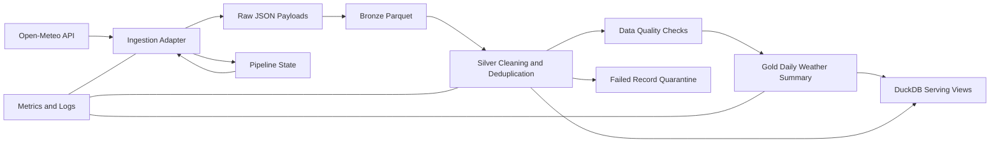

# PySpark ETL Data Lake

[](https://github.com/SamHavocH/pyspark-etl-datalake/actions/workflows/ci.yml)

Production-style PySpark data lake project for a mid-level Data Engineer portfolio. The pipeline ingests hourly weather data from Open-Meteo, lands the raw payload, creates bronze/silver/gold Parquet layers, records quality and execution metrics, and exposes curated tables through DuckDB for local analytics.

The goal is pragmatic engineering: clean package structure, reproducible local execution, typed modules, observable jobs, and tests without pretending this is a giant platform.

## Architecture



## Stack

- Python 3.12 package under `src/datalake`
- PySpark local mode for transformations and Parquet writes
- Parquet medallion lake: raw, bronze, silver, gold
- DuckDB views for lightweight analytics
- `pydantic-settings` for environment configuration
- `tenacity` for network retry handling
- `pytest` and `ruff` for test and code quality
- `uv`, Docker Compose, Makefile, pre-commit, and GitHub Actions CI

## Repository Layout

```text
.
├── docker/
├── data/
│   ├── raw/
│   ├── bronze/
│   ├── silver/
│   └── gold/
├── notebooks/
├── src/datalake/
│   ├── configs/
│   ├── ingestion/
│   ├── jobs/
│   ├── monitoring/
│   ├── transformations/
│   └── utils/
├── tests/
├── scripts/
├── .github/workflows/
├── pyproject.toml
├── docker-compose.yml
├── Makefile
└── README.md
```

## ETL Flow

1. Resolve an incremental processing window from `data/state/pipeline_state.json`.
2. Fetch hourly weather observations from Open-Meteo with retry handling.
3. Persist the source response under `data/raw/open_meteo/run_id=.../payload.json`.
4. Convert the payload to a typed bronze DataFrame and write partitioned Parquet.
5. Build silver records by parsing timestamps, standardizing names, validating ranges, and deduplicating by `location_id` and `observed_at_utc`.
6. Quarantine failed rows under `data/failed` with a `failure_reason`.
7. Run lightweight data quality checks before publishing curated data.
8. Build gold daily aggregates for analytics.
9. Refresh DuckDB views and write run metrics to `data/metrics`.

## Medallion Tables

| Layer | Path | Purpose | Partitioning |
| --- | --- | --- | --- |
| Raw | `data/raw/open_meteo` | Exact API payload replay and audit | `run_id` directory |
| Bronze | `data/bronze/weather_hourly` | Source-shaped typed observations | `run_id` |
| Silver | `data/silver/weather_hourly` | Clean hourly facts | `year`, `month`, `date_utc` |
| Gold | `data/gold/weather_daily_summary` | Daily analytics summary | `year`, `month` |

## Local Setup

```bash
uv sync --all-extras
cp .env.example .env
uv run datalake run
```

Local PySpark execution requires Java 17 or another Spark-compatible JRE on `PATH`. The Docker image and GitHub Actions workflow install Java for you.

Dockerized execution:

```bash
docker compose build
docker compose run --rm datalake datalake run
```

Common Make targets:

```bash
make install
make run
make test
make lint
make format
make docker-run
make clean
```

## Configuration

`.env.example` contains all local defaults. The main knobs are:

- `LOCATION_ID`, `LATITUDE`, `LONGITUDE`: weather location identity
- `DAYS_BACK`: first-run historical window
- `OVERLAP_DAYS`: overlap applied after successful runs for late-arriving corrections
- `DATA_DIR`, `STATE_FILE`, `METRICS_DIR`: local lake and observability paths
- `SPARK_MASTER`, `SPARK_SHUFFLE_PARTITIONS`: local Spark tuning

## Idempotency and Incremental Strategy

The pipeline tracks the last successful run in `data/state/pipeline_state.json`. Each run overlaps the previous watermark by `OVERLAP_DAYS`, deduplicates records by natural key, and rewrites curated Parquet outputs from the merged silver dataset. If a job fails, state is not advanced.

This design favors correctness and readability for a local portfolio project. In a larger lake, the same pattern would usually become table-format upserts with Delta Lake or Apache Iceberg.

## Observability

Every run emits:

- structured console and file logs in `logs/pipeline.log`
- row counts for bronze, failed, silver, and gold outputs
- data quality results
- run status, duration, and error details in `data/metrics/<run_id>.json`
- failed records with explicit `failure_reason`

## DuckDB Analytics

After a successful run, DuckDB views are available in `data/warehouse.duckdb`:

- `silver_weather_hourly`
- `gold_weather_daily_summary`

Example:

```bash
duckdb data/warehouse.duckdb < scripts/query_duckdb.sql
```

Sample query:

```sql
SELECT
  date_utc,
  avg_temperature_c,
  total_precipitation_mm,
  weather_profile
FROM gold_weather_daily_summary
ORDER BY date_utc DESC
LIMIT 14;
```

## Testing

```bash
uv run pytest
uv run ruff check src tests
```

The tests use a realistic Open-Meteo fixture with duplicate and invalid rows to verify cleaning, deduplication, aggregation, and quality failure behavior.

## Future Improvements

- Add Delta Lake or Iceberg for ACID upserts once the project needs multi-writer semantics.
- Add a second source, such as city metadata or air quality, for richer enrichment.
- Publish data contracts from the Spark schemas.
- Add a small dashboard over the DuckDB serving layer.
- Add Great Expectations if quality rules grow beyond lightweight checks.
