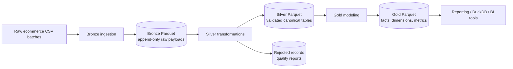

# PySpark Medallion Platform

[](https://github.com/sam/pyspark-medallion-platform/actions/workflows/ci.yml)

Production-style ecommerce analytics platform built with PySpark, Parquet, Docker Compose, `uv`, pytest, mypy, ruff, pre-commit, and GitHub Actions.

The repository models an internal data platform rather than a notebook demo. Business logic lives in Python modules under `src/pyspark_medallion`; notebooks are reserved for ad hoc analysis.

## Architecture



## Medallion Layers

**Bronze** keeps raw source records as append-only Parquet with `payload`, `source_system`, `source_file`, `ingestion_ts`, `ingestion_date`, and `batch_id`. It preserves source lineage and makes reprocessing possible.

**Silver** parses source payloads into enforced ecommerce schemas, normalizes strings, deduplicates by business keys, applies incremental watermarks, writes invalid records to quarantine, and stores canonical partitioned tables.

**Gold** builds reporting-oriented outputs:

- `fact_orders`
- `daily_sales`
- `customer_lifetime_value`
- `payment_metrics`
- `funnel_metrics`

## Dataset Scenario

The local generator creates realistic ecommerce data for:

- customers
- products
- orders
- transactions
- events

It also creates a small number of intentionally invalid records so the quarantine path and quality reports are observable during local runs.

## Repository Structure

```text
.
├── .github/workflows/ci.yml
├── docker/
├── docs/
├── notebooks/
├── scripts/
├── src/pyspark_medallion/
│   ├── config/
│   ├── ingestion/
│   ├── jobs/
│   ├── monitoring/
│   ├── quality/
│   ├── schemas/
│   ├── storage/
│   ├── transformations/
│   └── utils/
├── tests/
├── data/
├── docker-compose.yml
├── Makefile
└── pyproject.toml
```

## Local Setup

```bash
uv sync --extra dev
cp .env.example .env
make pipeline
```

Useful commands:

```bash
make up
make sample-data
make ingest
make transform
make gold
make quality-check
make test
make lint
make type-check
```

Docker services:

- `spark`: local PySpark runtime
- `spark-history`: Spark History Server at `http://localhost:18080`
- `postgres`: optional serving database for future publishing work

## Pipeline Flow

1. `medallion sample-data` writes synthetic source CSVs under `data/raw`.
2. `medallion ingest` appends source payloads to `data/bronze`.
3. `medallion transform` builds validated Silver tables and quality outputs.
4. `medallion gold` builds analytics-ready Gold tables.
5. `medallion quality-check` validates Silver keys and duplicate constraints.

`medallion pipeline` runs the full local flow end to end.

## Incremental Strategy

Silver jobs persist per-entity watermarks in `data/bookmarks.json`. Each run processes records where the entity watermark column is greater than or equal to the last successful value, then merges with the current Silver table by business key and latest `updated_at`.

This design keeps local implementation simple while preserving production concepts:

- deterministic upserts by natural keys
- idempotent table rewrites for small local data
- bookmark state updated only after accepted records are written
- partition-aware writes for high-volume event and order tables

## Partitioning And Storage

Parquet is the default storage format because it is portable, fast for local analytics, and easy to inspect without a metastore. Writes use Snappy compression.

Partitions:

- Bronze: `ingestion_date`
- Silver orders: `order_date`
- Silver transactions: `transaction_date`
- Silver events: `event_date`
- Gold facts and daily metrics: date columns used by reporting filters

Delta Lake is included as a dependency because it is the natural next step for ACID merge/upsert semantics. The current implementation intentionally keeps Parquet as the default so the project runs consistently in lightweight local and CI environments.

## Data Quality

Quality rules cover:

- required business keys
- invalid timestamps
- invalid monetary values
- invalid quantities
- duplicate business keys
- invalid currencies

Rejected records are written to `data/rejected_records`, partitioned by rejection date and reason. Run summaries are written to `data/quality_reports`.

Example structured log:

```json
{"timestamp":"2026-05-20T19:30:00Z","level":"INFO","logger":"pyspark_medallion.jobs.transform_silver","message":"silver transform completed","event":"job_completed","metrics":{"orders_total_rows":182,"orders_accepted_rows":180,"orders_rejected_rows":2}}
```

## Engineering Notes

- Typed configuration is centralized in `pyspark_medallion.config`.
- Spark session creation is centralized in `pyspark_medallion.utils.spark`.
- Schemas are explicit and versionable in `pyspark_medallion.schemas`.
- Jobs are thin orchestration layers around reusable transformations.
- Tests exercise transformation behavior, quality rules, business metrics, and bookmark persistence.

## CI

GitHub Actions runs:

- `ruff check`
- `mypy`
- `pytest`

## Future Improvements

- Switch Silver merges to Delta Lake `MERGE INTO` when using a Delta-compatible runtime.
- Publish selected Gold tables to PostgreSQL for a serving layer.
- Add Great Expectations or Deequ for richer quality profiling.
- Add dbt-duckdb models for semantic-layer style documentation.
- Add data contracts for source schemas and schema evolution alerts.
